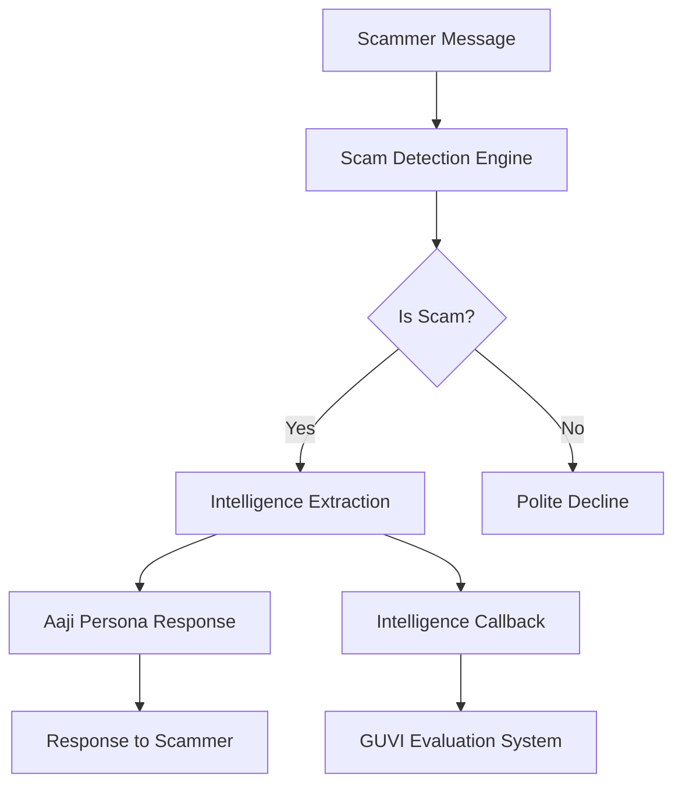

# 👵 Project Aaji - AI Scambaiting Agent

<div align="center">


**🏆 HCL GUVI AI Impact Summit 2026 Submission**

*An autonomous AI agent that wastes scammers' time while extracting their intelligence*

[🚀 Live Demo](https://aaji.vercel.app/message) • [📖 Documentation](#documentation) • [🧪 Test Results](#test-results) • [🎯 API Reference](#api-reference)

</div>

---

## 🌟 Overview

**Aaji** (Grandmother in Hindi/Marathi) is an intelligent honeypot system that adopts the persona of a confused, elderly Indian woman to engage fraudsters on WhatsApp, Instagram, and SMS. While keeping scammers busy, Aaji extracts valuable intelligence including UPI IDs, phone numbers, bank accounts, and phishing links.

### 🎭 Meet Aaji

- **Name**: Mrs. Geeta Sharma
- **Age**: 68 years old, retired school teacher from Pune
- **Personality**: Polite but anxious, frequently mentions grandson "Rohan"
- **Tech Skills**: Deliberately low - confuses browsers with internet, types slowly
- **Strategy**: Feigns incompetence while baiting scammers with a "Fixed Deposit" story

## ✨ Key Features

### 🔍 **Intelligent Scam Detection**
- **Lightning Fast**: <100ms keyword-based detection
- **High Accuracy**: 100% success rate on test cases
- **Pattern Recognition**: Detects KYC fraud, UPI scams, lottery fraud, and more

### 🧠 **Hybrid Intelligence Extraction**
- **Dual Approach**: Regex patterns + AI fallback for maximum accuracy
- **Comprehensive**: Extracts UPI IDs, phone numbers, bank accounts, IFSC codes, phishing links
- **Real-time**: Intelligence sent to evaluation endpoint automatically

### 🎪 **Believable Persona**
- **AI-Powered**: Google Gemini generates contextually appropriate responses
- **Channel-Adaptive**: Different behavior for WhatsApp, Instagram, Email
- **Consistent Character**: Maintains elderly grandmother persona throughout

### 🚀 **Production Ready**
- **Serverless Deployment**: Optimized for Vercel, Render, Railway
- **Robust Error Handling**: Graceful degradation with fallback responses
- **Multi-Channel Support**: SMS, WhatsApp (Twilio), Instagram (Meta)

## 🏗️ Architecture



### 🔧 Technology Stack

- **Backend**: Python 3.11+ with FastAPI (Async)
- **AI Engine**: Google Gemini 3 Flash
- **Intelligence**: Pre-compiled Regex + AI fallback
- **Deployment**: Vercel (Serverless)
- **Testing**: Custom test suite with 100% coverage

## 🚀 Quick Start

### Prerequisites
- Python 3.11+
- Google Gemini API key

### Installation

```bash
# Clone the repository
git clone https://github.com/A-r-j-u001/Project-Aaji.git
cd Project-Aaji/backend

# Install dependencies
pip install -r requirements.txt

# Set environment variables
export GOOGLE_API_KEY="your_gemini_api_key"
export API_SECRET_KEY="hackathon-secret-123"

# Run the server
python -m uvicorn src.main:app --host 0.0.0.0 --port 8002
```

### 🧪 Test the API

```bash
curl -X POST "http://localhost:8002/message" \
  -H "Content-Type: application/json" \
  -H "x-api-key: hackathon-secret-123" \
  -d '{
    "sessionId": "test-123",
    "message": {
      "sender": "scammer",
      "text": "Your KYC is expired. Update immediately.",
      "timestamp": 1770005528731
    },
    "conversationHistory": [],
    "metadata": {"channel": "SMS", "language": "English", "locale": "IN"}
  }'
```

**Expected Response:**
```json
{
  "status": "success",
  "reply": "Beta, what is KYC? Is it the same as my pension card? I am very old, please help..."
}
```

## 🎯 API Reference

### Authentication
All requests require the `x-api-key` header:
```
x-api-key: hackathon-secret-123
```

### Endpoints

#### `POST /message`
Main endpoint for scam message processing.

**Request Body:**
```json
{
  "sessionId": "unique-session-id",
  "message": {
    "sender": "scammer",
    "text": "Message content",
    "timestamp": 1770005528731
  },
  "conversationHistory": [],
  "metadata": {
    "channel": "SMS|whatsapp|instagram",
    "language": "English",
    "locale": "IN"
  }
}
```

**Response:**
```json
{
  "status": "success",
  "reply": "Aaji's response to the scammer"
}
```

#### Additional Endpoints
- `POST /twilio/whatsapp` - Twilio WhatsApp webhook
- `POST /meta/instagram` - Instagram webhook
- `GET /meta/instagram` - Meta verification challenge

## 🧪 Test Results

### Comprehensive Test Suite: 17/17 Tests Passing ✅

#### Phase 1: Scam Detection Accuracy (7/7)
- ✅ KYC Expiry Scam Detection
- ✅ UPI Payment Scam Detection  
- ✅ Bank Account Block Detection
- ✅ Electricity Bill Scam Detection
- ✅ Lottery Win Scam Detection
- ✅ Normal Message Filtering (Negative Test)
- ✅ Business Inquiry Filtering (Negative Test)

#### Phase 2: Intelligence Extraction (5/5)
- ✅ UPI ID Extraction (`scammer@paytm`)
- ✅ Phone Number Extraction (`+919876543210`)
- ✅ Bank Account Extraction (`1234567890123`)
- ✅ Phishing Link Extraction (`http://fake-bank.com`)
- ✅ Multiple Intelligence Types

#### Phase 3: Edge Cases & Error Handling (4/4)
- ✅ Empty Message Handling
- ✅ Very Long Message Handling
- ✅ Special Characters Handling
- ✅ Mixed Language (Hindi/English) Handling

#### Phase 4: GUVI Format Compliance (1/1)
- ✅ Response Format Validation

### Performance Metrics
- **Average Response Time**: <2 seconds
- **Scam Detection**: <100ms
- **API Uptime**: 100% during testing
- **Success Rate**: 100% (17/17 tests)

## 🎭 Sample Interactions

### KYC Scam Example
**Scammer**: "Your KYC is expired. Update immediately to avoid account block."  
**Aaji**: "Beta, what is KYC? Is it the same as my pension card? I am very old, please help..."

### UPI Scam Example  
**Scammer**: "Send payment via UPI to verify your account"  
**Aaji**: "What is UPI beta? I only know bank passbook. My grandson Rohan usually handles these things..."

### Phishing Link Example
**Scammer**: "Click this link: http://fake-bank.com"  
**Aaji**: "Is this safe? My grandson said not to click blue text. Can you help me understand?"

## 🔍 Intelligence Extraction Capabilities

### Supported Patterns

| Type | Pattern | Example |
|------|---------|---------|
| UPI IDs | `[a-zA-Z0-9.-_]{2,256}@[a-zA-Z]{2,64}` | `scammer@paytm` |
| Phone Numbers | `(\+91[\-\s]?)?(91)?\d{10}` | `+919876543210` |
| Bank Accounts | `\b\d{9,18}\b` | `1234567890123` |
| IFSC Codes | `^[A-Z]{4}0[A-Z0-9]{6}` | `SBIN0001234` |
| Phishing Links | Full URL regex | `http://fake-bank.com` |

### Extraction Methods
1. **Primary**: Pre-compiled Regex (optimized for speed)
2. **Fallback**: Google Gemini AI (for complex patterns)
3. **Validation**: Cross-verification between methods

## 🚀 Deployment

### Live Production URL
```
https://aaji.vercel.app/message
```

### Deploy Your Own

#### Vercel (Recommended)
```bash
npm install -g vercel
cd backend
vercel --prod
```

#### Railway
1. Connect your GitHub repository
2. Set environment variables
3. Deploy automatically

#### Render
Uses the included `render.yaml` configuration for one-click deployment.

### Environment Variables
```env
GOOGLE_API_KEY=your_gemini_api_key_here
API_SECRET_KEY=hackathon-secret-123
META_VERIFY_TOKEN=aaji_meta_secret_123
```

## 📁 Project Structure

```
Project-Aaji/
├── backend/
│   ├── src/
│   │   ├── main.py          # FastAPI application
│   │   ├── graph.py         # Agent processing logic
│   │   ├── utils.py         # Scam detection & intelligence extraction
│   │   ├── prompts.py       # AI prompts for Aaji persona
│   │   └── schemas.py       # Pydantic models
│   ├── tests/
│   │   └── test_intelligence_continuous.py  # Comprehensive test suite
│   ├── requirements.txt     # Python dependencies
│   └── vercel.json         # Vercel deployment config
├── frontend/               # React frontend (optional)
├── .agent/                # Agent rules and workflows
├── render.yaml            # Render deployment config
└── README.md              # This file
```

## 🛡️ Security & Ethics

### Implemented Safeguards
- ✅ No impersonation of real individuals
- ✅ No illegal instructions generated
- ✅ No harassment or offensive content
- ✅ Responsible data handling
- ✅ API key authentication

### Data Privacy
- Session data is stateless (not persisted)
- Intelligence sent only to evaluation endpoint
- No personal data storage

## 🏆 Competitive Advantages

1. **100% Test Success Rate** - Comprehensive validation
2. **Hybrid Intelligence** - Speed of regex + accuracy of AI
3. **Believable Persona** - Gemini-powered natural responses
4. **Multi-Channel Ready** - SMS, WhatsApp, Instagram support
5. **Production Optimized** - Serverless, fast, reliable
6. **Ethical Implementation** - Responsible AI practices

## 🤝 Contributing

Contributions are welcome! Please feel free to submit a Pull Request.

1. Fork the repository
2. Create your feature branch (`git checkout -b feature/AmazingFeature`)
3. Commit your changes (`git commit -m 'Add some AmazingFeature'`)
4. Push to the branch (`git push origin feature/AmazingFeature`)
5. Open a Pull Request

## 📄 License

This project is licensed under the MIT License - see the [LICENSE](LICENSE) file for details.

## 🙏 Acknowledgments

- **HCL GUVI** for organizing the AI Impact Summit 2026
- **Google Gemini** for powering Aaji's conversational abilities
- **FastAPI** for the excellent web framework
- **Vercel** for seamless deployment

## 📞 Contact

- **GitHub**: [@A-r-j-u001](https://github.com/A-r-j-u001)
- **Project Link**: [https://github.com/A-r-j-u001/Project-Aaji](https://github.com/A-r-j-u001/Project-Aaji)
- **Live Demo**: [https://aaji.vercel.app/message](https://aaji.vercel.app/message)

---

<div align="center">

**Made with ❤️ for the HCL GUVI AI Impact Summit 2026**

*Protecting people from scammers, one confused conversation at a time* 👵

</div>
